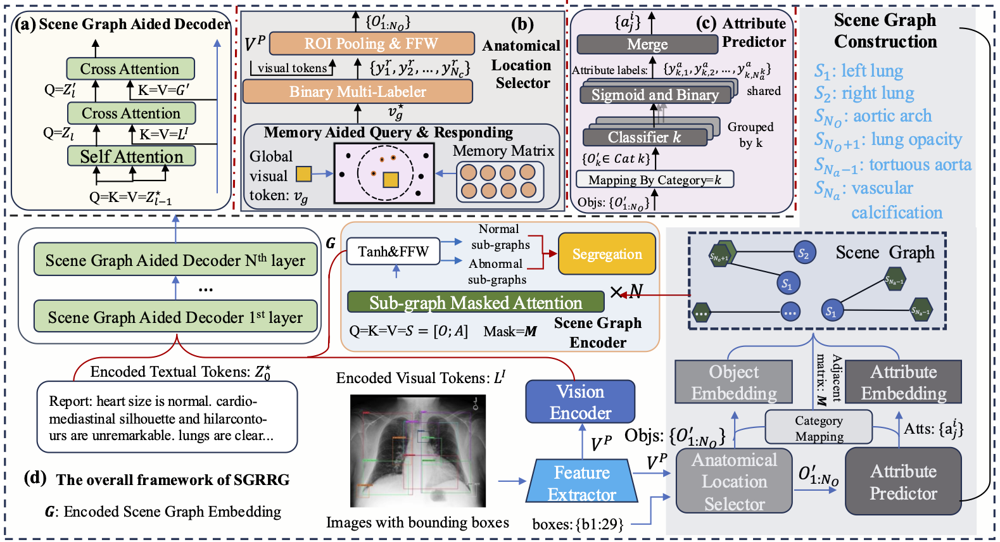

# SGRRG

[CMIG 2025] This is the official implementation of [SGRRG: Leveraging radiology scene graphs for improved and abnormality-aware radiology report generation](https://www.sciencedirect.com/science/article/pii/S0895611125001533) accepted to  Computerized Medical Imaging and Graphics (CMIG), 2025.

## Abstract

Radiology report generation (RRG) methods often lack sufficient medical knowledge to produce clinically accurate reports. A scene graph provides comprehensive information for describing objects within an image. However, automatically generated radiology scene graphs (RSG) may contain noise annotations and highly overlapping regions, posing challenges in utilizing RSG to enhance RRG. To this end, we propose Scene Graph aided RRG (SGRRG), a framework that leverages an automatically generated RSG and copes with noisy supervision problems in the RSG with a transformer-based module, effectively distilling medical knowledge in an end-to-end manner. SGRRG is composed of a dedicated scene graph encoder responsible for translating the radiography into a RSG, and a scene graph-aided decoder that takes advantage of both patch-level and region-level visual information and mitigates the noisy annotation problem in the RSG. The incorporation of both patch-level and region-level features, alongside the integration of the essential RSG construction modules, enhances our framework’s flexibility and robustness, enabling it to readily exploit prior advanced RRG techniques. A fine-grained, sentence-level attention method is designed to better distill the RSG information. Additionally, we introduce two proxy tasks to enhance the model’s ability to produce clinically accurate reports. Extensive experiments demonstrate that SGRRG outperforms previous state-of-the-art methods in report generation and can better capture abnormal findings.



## Citations

If you use or extend our work, please cite our paper.
```
@article{wang2025sgrrg,
  title={SGRRG: Leveraging radiology scene graphs for improved and abnormality-aware radiology report generation},
  author={Wang, Jun and Zhu, Lixing and Bhalerao, Abhir and He, Yulan},
  journal={Computerized Medical Imaging and Graphics},
  pages={102644},
  year={2025},
  publisher={Elsevier}
}
```

## Prerequisites

The following packages are required to run the scripts:
- [Python >= 3.8.10]
- [PyTorch = 1.10.2]
- [Torchvision]
- [Pycocoevalcap]

* You can create the environment via conda:
```bash
conda env create --name [env_name] --file env.yml
```


## Download Trained Models
You can download the trained models [here](https://drive.google.com/file/d/1Scc0rbk2MN4VNYvDrxrd1NCF2SV6uHsU/view?usp=drive_link).

## Datasets
We use two datasets (Chest ImaGenome and IU X-Ray) in our paper.

For `IU X-Ray`, you can download the dataset from [here](https://openi.nlm.nih.gov/faq).

For `Chest ImgGenome`, you can download the dataset from [here](https://physionet.org/content/chest-imagenome/1.0.0/), and our processed scene graph annotations and bounding box annotations from [here](https://drive.google.com/drive/folders/1fZgKffE5wOS0rIHc4J-eUhANCURfLOm9?usp=sharing).

After downloading the datasets, put the in the directory `datasets`, and run 
```bash
python3 serialize/cxr_gnome.py
```
to transform the original image and annotations into the .arrow file. Put the processed annotations files in `datasets/cxr_gnome/annotations`


## Run on Chest ImaGenome

Run `bash run_mimic.sh` to train a model on the MIMIC-CXR data.

## Test on Chest ImaGenome

Run `bash scripts/test_cgnome.sh` to train a model on the MIMIC-CXR data.

## Acknowledgment
Our project references the codes in the following repos. Thanks for their works and sharing.
- [R2GenCMN](https://github.com/cuhksz-nlp/R2GenCMN)
